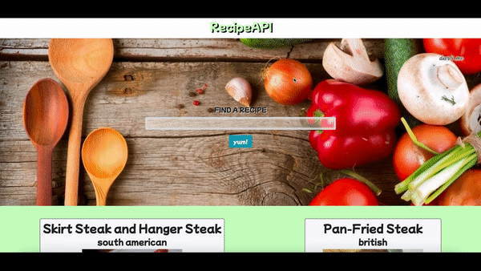

# Recipe API
https://recipe-api-seven.vercel.app/
 - Recipe API website made on React.js using HTML, CSS, Bootstrap, and JSX. Deployed on Vercel.
 - This project was bootstrapped with [Create React App](https://github.com/facebookincubator/create-react-app).
 
 ## Features
- Search for recipes
- Can search for food and beverages
- Shows cuisine type and ingredients

## Future Plans
- Create login and sign up feature
- Create database to hold user favorite recipes
- Update API to include more recipe information
 
> [RecipeAPI](https://recipe-api-seven.vercel.app/)

> By [Kevin Castillo](https://www.linkedin.com/in/kevinjcastillo)

## Installation
```
$ git clone https://github.com/KJCastillo/recipeAPI
$ cd recipeAPI
```
For Windows, Mac, Linux or Gitpod, start server with live reload after python installation:
```
$ python3 -m http.server
```

